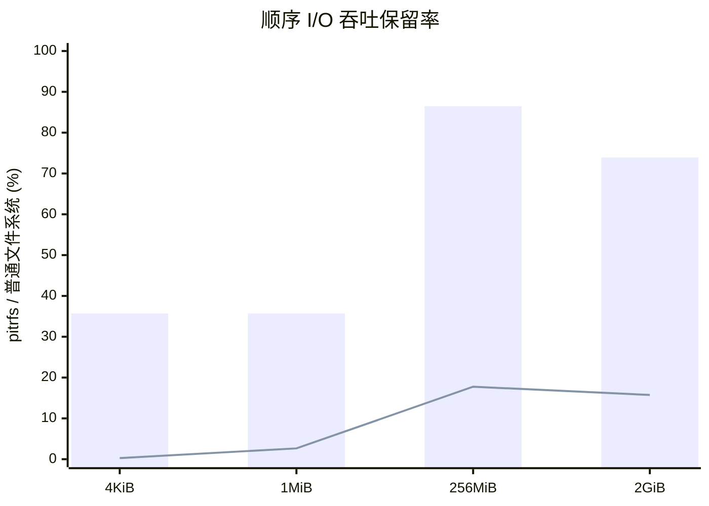
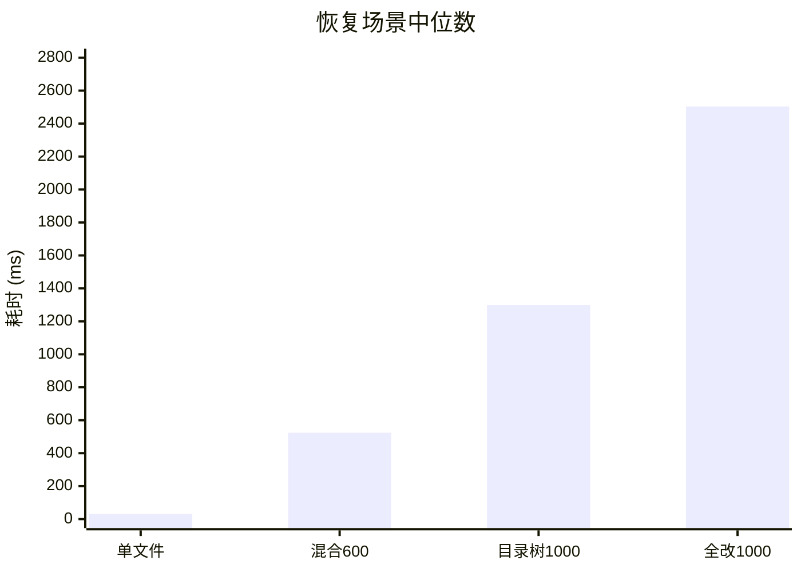

# pitr-fs

> **平台限制：pitr-fs 当前仅支持 Linux。** macOS 和 Windows 不能直接安装或
> 运行服务端；安装脚本会检测操作系统并拒绝在非 Linux 环境继续执行。

pitr-fs 是运行在 JuiceFS 之上的时间回溯文件系统。它透明拦截挂载目录中的
写操作，把每次成功的 POSIX 写操作记录为一个版本，并通过 PostgreSQL
元数据 undo-log 恢复目录或整个卷，无需为每个版本复制完整文件。

## 功能描述

- 默认自动版本模式，无需 `begin` 或 `commit`。创建、写入、截断、删除、
  重命名、链接和扩展属性变更都会自动形成版本。
- 默认全局保留最近 100 个版本；`history-limit` 可配置并持久化，设为 `-1`
  时不限制版本数量。
- 可按用户熟悉的文件容量设置空间上限和预留比例；默认在预计占用达到上限的
  80% 时从最老版本开始裁剪，共享 slice 只在最后一个引用释放时计入空间。
- CLI 支持绝对路径和相对路径，相对路径按调用命令时的工作目录解析。
- 支持按 12 位版本号回滚，也支持按带时区的 RFC3339 时间回滚；后者选择
  完成时间不晚于目标时间的最近版本。
- `logs -l` 展示版本号、POSIX 操作、调用进程命令、操作时间、操作人和
  内容变化摘要。
- `clear --global --yes` 永久清空历史，同时保留当前文件作为新基线。
- 历史版本在 slice 维度持有对象引用；版本淘汰或 `clear` 后自动释放引用，
  后台批量调用 JuiceFS 原生 GC 回收不再可达的对象。
- 块数据默认保存在本地 Docker volume，也可直接使用用户已经挂载到 Linux
  主机的任意目录，或使用 JuiceFS 支持的远端对象存储。
- 支持目录范围 `diff`、服务恢复以及 Go/Python SDK。
- 支持带 SHA256 校验的本地逻辑升级包；升级只重启 `pitrd`/FUSE，不重建
  容器、PostgreSQL 或数据卷，并可回退到上一个逻辑版本。
- 固定使用 JuiceFS v1.3.0 LTS 和 PostgreSQL 16.14；启动时校验二进制补丁
  标记、MetaVersion、内部字段类型和唯一键，不在未知元数据结构上运行。

内容摘要是有界诊断信息，不是完整 diff：每个文件最多读取前 4 KiB，一个
写窗口最多保留 3 个 64 B 样本；二进制文件只显示类型和大小。进程命令从
Linux `/proc/<pid>/cmdline` 尽力获取，用户名按 UID 从宿主机只读
`/etc/passwd` 解析。命令超过 10 个 Unicode 字符后会缩略。

## 性能表现与基线

Linux 虚拟机、本地 JuiceFS file 后端、Btrfs 对照盘，独立三轮取中位数。以下是
最重要的结果，不作为不同硬件或对象存储的统一 SLA。

| 关键指标 | 实测结果 | 结论 |
|---|---:|---|
| 256 MiB 顺序写 | pitrfs 保留普通盘 86.47% 吞吐 | 大文件表现较好 |
| 2 GiB 顺序写 | pitrfs 保留普通盘 73.92% 吞吐 | 存在约 26% 损失 |
| 256 MiB 顺序读的 pitr 层增量损失 | 3.85% | 达到 ≤10% 目标 |
| 创建 2000 文件 | 10.13 ms/op，底层 JuiceFS 为 2.07 ms/op | 元数据是主要瓶颈 |
| 4 KiB 随机写 | 256 MiB–2 GiB 文件内约 1.3–1.5 MiB/s | 当前最弱场景 |
| 单个 256 MiB 文件恢复 | 31.57 ms | 只回放 5 行 history |
| 1000 文件全部修改后恢复 | 2503.41 ms | 回放 3000 行 history |
| 100,000 目录项恢复 | 367–725 ms | 三轮正确性通过 |

总体上，当前版本更适合顺序大文件和恢复型负载；高频小文件元数据操作、随机覆写
仍需优化。

顺序 I/O 随文件规模的吞吐保留率如下。柱为顺序写，折线为顺序读；数值是完整
pitrfs 相对普通文件系统的百分比。



恢复耗时主要随回放的元数据历史和目录结构复杂度增长，而不是按文件体积复制：



完整数据与口径见：[I/O 与恢复](bench/IO_RECOVERY.md)、
[生产路径增量开销](bench/PROD.md)、[四维基线](bench/BASELINE.md)、
[复现说明](bench/README.md)和[性能瓶颈分析](docs/性能瓶颈.md)。

## QuickStart

以下命令都应在 **Linux 主机**中执行。

### 1. 获取源码

极简 Linux 可能没有 Git，可只用系统自带的 `curl` 和 `tar` 下载：

```bash
curl -fL https://github.com/cadeYDL/pitr_fs/archive/refs/heads/main.tar.gz \
  -o /tmp/pitr-fs.tar.gz
tar -xzf /tmp/pitr-fs.tar.gz
cd pitr_fs-main
```

已有 Git 时也可以执行：

```bash
git clone https://github.com/cadeYDL/pitr_fs.git pitr-fs
cd pitr-fs
```

### 2. 一键安装环境与服务

```bash
./install.sh install
pitr status
```

`install` 会自动检查 Linux 环境，并通过 `apt`、`dnf`、`yum`、`pacman` 或
`zypper` 安装缺失的 Docker、FUSE3、util-linux、CA 证书、curl、Git、Python 3
和 awk。已有命令和可用 Docker 不会被替换、升级、重启或重新配置。安装器把本项目
实际新增的软件包、Docker 组成员和服务状态记录在
`/var/lib/pitr-fs/host-install.state`，重复安装不会覆盖最初状态。
挂载根、块存储路径和容器/数据卷名称等非敏感参数保存在
`/etc/pitr-fs/install.conf`，后续 `recover` 和 `uninstall` 无需重复设置环境变量；
命令行环境变量仍可显式覆盖。访问凭证不会写入该文件。

若刚把当前用户加入 `docker` 组，安装程序会在重新登录前自动使用 `sudo`。可单独
执行 `./scripts/install-deps.sh --check` 做只读环境检查。最小宿主机要求是可用的
`/dev/fuse`、shared bind propagation，以及内核 FUSE 的
`DIRECT_IO_ALLOW_MMAP` 能力。`pitr init` 会在挂载协商时做权威检查；
不支持的内核会收到明确错误，不会降级到无法保证升级写入原子性的缓存写模式。

用户不需要单独安装、初始化或配置 JuiceFS 和 PostgreSQL：它们由 pitr-fs 镜像
在内部管理。镜像不会运行 JuiceFS 的在线安装脚本，也不会在构建时获取
`latest`：JuiceFS 固定到 v1.3.0 的指定 commit，PostgreSQL 固定到 16.14
镜像摘要。首次从源码构建镜像时 JuiceFS 编译耗时较长，后续由 Docker 层缓存；
发布产物应由 CI 预构建，普通用户安装时只拉取并校验固定镜像或二进制。

安装只启动服务，不会擅自占用用户目录。默认允许挂载到 `/pitr` 的子目录；
可在首次安装时通过 `PITR_MOUNT_ROOT=/自定义根目录` 修改。挂载根不能是 `/`。

默认块数据写入本地 Docker volume。若块存储已经由用户挂载到 Linux 主机，
可将其目录绑定给 pitr-fs：

```bash
PITR_BLOCK_PATH=/mnt/pitr-blocks ./install.sh install
```

`PITR_BLOCK_PATH` 必须是可写的绝对路径，且不能与 `PITR_MOUNT_ROOT` 重叠。
卸载时即使指定 `--purge`，安装脚本也不会删除这个用户目录。S3、MinIO、OSS
等后端仍可通过 `PITR_STORAGE`、`PITR_BUCKET` 和对应凭证配置。

JuiceFS 本地缓存使用独立的 `pitr_cache` Docker volume，默认上限为
1024 MiB，不会写入容器可写层。可在首次安装时调整：

```bash
PITR_JFS_CACHE_SIZE=2048 ./install.sh install
```

缓存卷名和上限会写入安装配置；普通卸载和彻底卸载都会删除这个临时缓存卷，
不会影响 PostgreSQL 元数据卷和对象数据卷。

使用已部署、且能从 pitr-fs 容器访问的 MinIO：

```bash
PITR_STORAGE=minio \
PITR_BUCKET=http://minio.storage.example:9000/pitr-data \
AWS_ACCESS_KEY_ID=pitr-access-key \
AWS_SECRET_ACCESS_KEY='替换为实际密钥' \
./install.sh install
```

`PITR_BUCKET` 必须包含 bucket 名，域名或 IP 必须能从容器内解析并访问；不要写
`127.0.0.1` 代表宿主机。对象后端只在首次格式化卷时确定，已有元数据卷执行
`recover` 不会切换后端。生产环境应通过受控的密钥注入方式提供凭证；安装器
不会把上述凭证写入 `/etc/pitr-fs/install.conf`。

### 3. 初始化并挂载目录

> **挂载前请确认目标是专用的新目录或空目录。** `pitr init` 会在目标路径上
> 建立文件系统挂载；原目录中已经存在的文件会被挂载层遮蔽，也不会自动导入
> pitr-fs。请先迁移已有数据，避免把“被遮蔽”误认为丢失或覆盖。

绝对路径：

```bash
mkdir -p /pitr/data
pitr init /pitr/data
```

相对路径：

```bash
cd /pitr
mkdir -p data
pitr init ./data
```

初始化时同时设置版本数和空间水位：

```bash
pitr init ./data --history-limit 100 --max-space 100GiB --space-reserve 20
```

这里的 `100GiB` 表示当前文件和可恢复历史预计可占用的文件数据额度；预留
`20%` 表示达到约 `80GiB` 时开始淘汰最老版本。估算按去重 slice 大小计算，
不包含对象存储协议开销、压缩差异和异步 GC 尚未删除的临时占用。

当前版本一个服务只管理一个全局卷和一个挂载路径。`init` 幂等执行，并把路径
与保留策略写入 PostgreSQL；容器重启后会自动恢复这个挂载。

### 4. 快速验证

```bash
cd /pitr/data
mkdir -p quickstart
echo 'v1sdadsadas' > quickstart/test.txt
echo 'v2dasdas' > quickstart/test.txt
pitr logs quickstart/test.txt -l -n 10
```

复制第一列中的目标版本号，然后回滚：

```bash
pitr revert <版本号> --path quickstart
cat quickstart/test.txt
```

### 5. 查看版本与逻辑升级

```bash
pitr version
```

默认从 GitHub Releases 下载最新已发布版本；dev/test Pre-release 使用明确的
`dev-*`/`test-*` 版本号，不会伪装成正式版本。也可以指定不可变版本，或继续
使用本地离线包：

```bash
pitr upgrade --check
pitr upgrade
pitr upgrade dev-0123456789ab

# 离线升级
mkdir -p dist
PITR_VERSION=dev-test ./scripts/build-upgrade-bundle.sh dist/pitr-dev-test.tar.gz
pitr upgrade --bundle dist/pitr-dev-test.tar.gz --check
pitr upgrade --bundle dist/pitr-dev-test.tar.gz
```

远端升级会根据 Linux CPU 自动选择 `amd64` 或 `arm64` 资产；交互式终端会显示
构建包下载进度条，脚本和 CI 中则只输出阶段日志。下载完成后先校验 GitHub
Release API 提供的 SHA256 摘要，再校验包内每个文件。默认仓库是
`cadeYDL/pitr_fs`；私有镜像或 fork 可在安装时设置
`PITR_UPDATE_REPOSITORY=owner/repo`，私有仓库可临时通过 `GITHUB_TOKEN` 下载。

实际升级前会提示：文件系统服务和挂载将短暂中断，请先确保没有写入。交互确认后，
升级器先原子冻结写入口；冻结后的创建、覆盖、删除、重命名等操作会直接返回
`EBUSY`，不会写入底层文件或产生中间版本。已经进入代理的当前单次写请求会先返回；
随后升级器关闭仍开放的底层句柄，撤销该自动版本中已经写入的全部半成品。原进程继续使用旧 fd 会失败，
升级不会等待无法估算剩余时间的大文件写完。之后只切换版本化的
`pitr`、`pitrd` 和幂等 schema，容器、PostgreSQL、对象存储及数据卷保持运行；
只有 schema SHA256 发生变化时才执行数据库校准，已应用的摘要会持久化；
纯二进制升级和后续容器恢复不会重建 slice 索引。健康检查失败会自动恢复旧逻辑。
升级必须从 pitr 管理目录之外执行，例如先运行 `cd /`；否则父 Shell 会在 FUSE
重挂载后继续持有失效的当前目录。CLI 会在停止服务前拒绝这种调用，并给出重试方法。
目标版本与当前 JuiceFS/PostgreSQL 契约不兼容时也会在卸载前取消，不会先中断服务。
非交互环境必须显式传 `--yes`。回退上一个逻辑版本：

```bash
pitr upgrade --rollback
```

老安装首次启用版本化逻辑目录或自动下载升级器时，需要先使用包含该能力的新版
源码执行一次 `./install.sh install`；安装器会写入稳定的宿主分发器，此后升级包
会连同升级器自身一起更新，普通逻辑升级不再重建容器。基础镜像、PostgreSQL 或
JuiceFS 自身升级仍属于完整容器升级，不在 `pitr upgrade` 的范围内。

从早期“构建时下载 latest JuiceFS”的安装迁移到本版本时，需要在源码目录重新
执行一次 `./install.sh install`，不能只执行 `pitr upgrade`。安装器会重建容器，
但继续挂载原 PostgreSQL、对象数据和缓存卷；开始前仍建议完成卷级备份。迁移入口
会在应用任何 pitr schema 之前只读校验 JuiceFS/PostgreSQL ABI，不兼容时直接
停止；基础镜像的排序规则版本发生变化时，会在服务启动前自动重建相关数据库索引。
JuiceFS 1.4.0、MetaVersion 1 创建的旧测试卷已经完成读取、继续写入和历史
回滚验证；使用其他版本或特殊元数据功能的卷仍应先在副本上验收。

恢复服务、卸载或彻底清理：

```bash
./install.sh recover
./install.sh status
./install.sh logs             # 查看服务诊断日志，无需使用 docker 命令
source ./uninstall.sh
source ./uninstall.sh --purge  # 永久删除数据，并清理由本项目安装的宿主依赖
```

普通卸载和不可恢复的彻底清理有不同语义，详见下方“卸载与彻底清理”。

## 卸载与彻底清理

### 普通卸载：保留数据以便恢复

```bash
source ./uninstall.sh
```

普通卸载会解除 pitr-fs 挂载、删除服务容器和 `/usr/local/bin/pitr`，但保留：

- PostgreSQL 元数据卷和对象数据卷；
- pitr-fs 安装的宿主机依赖；
- `/etc/pitr-fs/install.conf` 中的非敏感安装参数。

JuiceFS 临时缓存卷会在普通卸载时删除；它不包含唯一数据，重新安装时会自动
创建。

因此之后可以直接恢复原来的数据和挂载：

```bash
./install.sh recover
```

### 彻底卸载：永久删除数据和受管依赖

> **警告：以下操作不可恢复。执行前请确认不再需要任何历史版本和当前文件。**

```bash
source ./uninstall.sh --purge
```

彻底卸载会删除：

- pitr-fs 服务容器、FUSE 挂载和 `/usr/local/bin/pitr`；
- `pitr_pgdata` 中的 PostgreSQL 元数据和 `pitr_data` 中的对象数据；
- `/etc/pitr-fs/install.conf`；
- `/var/lib/pitr-fs/host-install.state` 记录的、由 pitr-fs 实际新增的软件包、
  Docker 镜像、用户组和运行数据。

以下内容不会删除：

- 安装前已经存在的软件包、Docker、镜像和系统配置；
- 用户通过 `PITR_BLOCK_PATH` 指定的外部存储目录及其内容；
- pitr-fs 源码目录。

如果 Docker 是由 pitr-fs 安装的，但后来出现了其他容器、镜像、数据卷或自定义
网络，安全检查会拒绝卸载 Docker，并保留安装清单。确认并自行迁移这些外部对象后，
再次运行同一条命令即可继续清理：

```bash
source ./uninstall.sh --purge
```

可用以下命令确认 pitr-fs 已彻底清理；第一条不应输出路径，后两条应输出确认信息：

```bash
findmnt -rn -t fuse.pitrfs -o TARGET
test ! -e /usr/local/bin/pitr && echo 'pitr 命令已删除'
test ! -e /var/lib/pitr-fs/host-install.state && echo '安装清单已删除'
```

`uninstall.sh` 必须通过 `source` 在当前 Bash 中执行，直接运行 `./uninstall.sh` 会拒绝
执行并给出正确用法。实际清理在隔离的子 Shell 完成，返回当前 Shell 后会自动刷新
Bash 的命令路径缓存（即使彻底卸载因外部 Docker 资源保护而中止也会刷新），因此
不会留下指向 `/usr/local/bin/pitr` 的失效快捷路径，也不需要额外执行 `hash -r`。
安装器不会创建 shell alias 或 function；若 `type -a pitr` 仍显示用户自行配置的
alias/function，需要从对应的 shell 配置文件中删除它。

## 使用指南

查看状态和历史：

```bash
pitr status
pitr logs . -n 20
pitr logs . -l -n 20
```

长日志列顺序固定为：

```text
版本号  POSIX操作  原始命令  操作时间  操作人  内容变化
```

设置持久化的全局历史上限。可使用任意正整数，`-1` 表示不按版本数量裁剪：

```bash
pitr config
pitr config list
pitr config set history-limit 100
pitr config set history-limit -1
pitr config set max-space 100GiB
pitr config set space-reserve 20%
```

`pitr config` 与 `pitr config list` 等价，会列出所有支持项、当前值、默认值、
取值范围和说明。目前支持 `history-limit`、`max-space` 和 `space-reserve`；
`pitr config --help` 也会显示这些键。`history-limit=-1` 只关闭数量裁剪，
已配置的空间水位仍会从最老版本开始淘汰。

查看当前空间水位，以及按最老优先顺序单独删除每个版本的预计释放量：

```bash
pitr space . -n 20
```

输出中的 `retained` 是当前文件和可恢复版本仍需保留的 slice；`reclaimable`
是引用已经归零、等待后台 GC 物理删除的空间。`RELEASE_IF_DELETED` 是以查询
时引用关系计算的边际值，前一个版本删除后，共享 slice 的释放量可能转移到
后续版本，因此裁剪器每删除一个版本都会重新判断。

按版本或时间回滚：

```bash
pitr revert 2c45c99418e8
pitr revert 2c45c99418e8 --path ./project
pitr revert 2c45c99418e8 --global
pitr revert --at '2026-07-31T18:30:00+08:00' --path ./project
pitr revert --at '2026-07-31T10:30:00Z' --dry-run
```

把一段连续的底层写操作压缩为一条业务变更记录：

```bash
# base 自身保留；实际合并范围是 (base,end]
pitr squash <base版本号> <end版本号> -m '发布用户登录功能' --dry-run
pitr squash <base版本号> <end版本号> -m '发布用户登录功能' --yes
```

`squash` 保留 base 和 end 两个版本号，永久删除中间版本，并让 end 表示从
base 到 end 的净变化。长日志中操作显示为 `squash`、原始命令显示为 `-`、
操作时间使用被压缩的第一个操作时间、内容变化使用 `-m`。按时间回滚仍使用
end 原本的完成时间，因此不会改变 `revert --at` 的边界。建议先用
`--dry-run` 预览；实际执行必须显式添加 `--yes`。

比较版本、清空历史和手动卸载/重新挂载：

```bash
pitr diff 2c45c99418e8 7a09ce104d31 --path ./project
pitr clear --global --yes
pitr umount /pitr/data
pitr mount /pitr/data
```

`clear` 不删除当前文件和持久配置，但被清除的历史无法恢复。当前控制面只
开放全局配置与全局清理。

### 性能测试

对专门用于测试且已经 `init` 的空挂载执行完整 I/O 与恢复基准：

```bash
./bench/run-io-recovery.sh /pitr/bench
```

快速小样本：

```bash
PITR_BENCH_ROUNDS=1 \
PITR_BENCH_OUTPUT="$HOME/pitr-bench-result" \
./bench/run-io-recovery.sh /pitr/bench
```

默认执行三轮并自动取中位数。脚本会自动准备 fio 容器、保存并恢复配置、校验
恢复结果以及清理当前测试文件；详细空间要求和参数见
[`bench/README.md`](bench/README.md)。

开发者若要单独测量 pitr 层相对同一 JuiceFS 卷的增量开销，可运行：

```bash
for run in 1 2 3; do
  PITR_PROD_RESULTS="/tmp/pitr-prod-$run" \
  PITR_BENCH_MOUNT=/pitr/data ./bench/bench-prod.sh
done

python3 ./bench/prod_aggregate.py /tmp/pitr-prod-median.csv \
  /tmp/pitr-prod-{1,2,3}/prod.csv
```

## 例子

`logs -l` 的典型输出如下，实际路径、用户和版本号会不同：

```text
2c45c99418e8  open("/pitr/data/test.txt", O_WRONLY|O_CREAT|O_TRUNC, 0644)  bash  2026-07-31T18:20:10+08:00  user(uid=1000,gid=1000,pid=321)  ∅ -> ""
7a09ce104d31  write("/pitr/data/test.txt", offset=0, total=11, calls=1)  bash  2026-07-31T18:20:10+08:00  user(uid=1000,gid=1000,pid=321)  "" -> "v1sdadsadas"
```

一个 `echo` 可能对应创建/截断和写入两个 POSIX 操作，因此形成两个版本；
这些版本会尽力记录相同的调用进程命令。版本只在操作成功后关闭，按时间
回滚不会选择仍在写入中的开放版本。

按时间回滚的 Shell 例子：

```bash
target_time="$(date --iso-8601=seconds)"
sleep 1
echo later > test.txt
pitr revert --at "$target_time" --path .
```

## 设计概述

```text
应用 POSIX 操作
    -> 用户挂载点上的 FUSE proxy（打开自动版本并采集有界审计信息）
    -> 私有 JuiceFS 挂载（文件数据写入对象存储）
    -> PostgreSQL 触发器（把 jfs_* 旧值写入 pitr_*_history）
    -> 操作完成后关闭版本并按 history-limit 裁剪
```

安装时，宿主机的 `PITR_MOUNT_ROOT` 以相同绝对路径、`rshared` 方式绑定进
容器。`pitr init <path>` 只能选择该根目录下的子目录，daemon 随后在同一路径
创建 FUSE 挂载并持久化配置。这个边界避免把整个宿主根文件系统暴露给容器。

`pitrd` 通过 Unix socket 提供 gRPC 控制面。CLI 和 SDK 负责路径解析与请求
封装；版本选择、完整性检查、目录范围解析和 history 回放在 daemon 内完成。

回滚不会复制整份文件。daemon 在一个 PostgreSQL 事务中锁定版本时间线，
逆序恢复目标版本之后的 JuiceFS 元数据，并把回滚本身记录为新版本。目录级
回滚结合当前目录图与历史 edge 计算 inode 闭包，因此目录被改名或删除后
仍可定位。

每份首次捕获的旧 `jfs_chunk` 状态都会把其中 slice 以紧凑二进制列表挂到
对应版本，并增加 JuiceFS 物理引用计数。版本因 `history-limit` 淘汰或被
`clear` 删除时，同一数据库事务会逐 slice 减少引用并写入持久化 GC 请求。
原来的远期 pin 会被转换为 JuiceFS 立即到期的待删记录，而不是直接丢弃，确保
零引用 slice 仍能被原生 delete 扫描发现。
daemon 低频合并请求，在没有开放写窗口时执行 JuiceFS 原生 `gc --delete`；
进程崩溃不会丢请求，GC 失败也不会影响当前数据。例行生命周期 GC 不主动
compact 当前 chunk，减少对前台读取和写入的扰动。
这使“最多 100 个版本”同时约束元数据历史和这些历史独占的块对象，不过当前
版本本身、JuiceFS 合并过程的临时对象以及异步 GC 尚未运行时的对象仍会占用
空间，因此它不是严格的字节配额。

`PITR_GC_INTERVAL` 控制后台合并间隔（默认 `10m`，`0` 停用），
`PITR_GC_THREADS` 控制对象删除并发（默认 `4`）。停用 GC 只会延后物理删除，
不会破坏版本引用的正确性。

JuiceFS 读缓存通过 `PITR_JFS_CACHE_SIZE` 限制，默认 1024 MiB，并存放在独立
缓存卷。不能只依赖 JuiceFS 的宿主空闲比例判断：容器或虚拟机可能存在宿主
`df` 不可见的配额，未限制的默认 100 GiB 缓存会先撞穿该配额并拖累 PostgreSQL。

空间计数由 `jfs_chunk_ref` 的增量触发器维护，不在普通写入中遍历对象存储。
当引用从正数降为零时，slice 从 `retained` 转入 `reclaimable`，并把预计字节
累计到 GC 请求。空间水位与版本数上限同时生效，任何一项超限都会触发裁剪；
空间策略允许最终删除全部用户版本，但永远不会为了配额删除当前文件内容。
如果当前文件本身已经超过高水位，系统会报告超限，删除历史也无法继续降低。

### 固定运行时与内部 ABI

pitr-fs 为恢复内容必须访问 JuiceFS 的 `jfs_node`、`jfs_edge`、`jfs_chunk`、
`jfs_chunk_ref` 和 `jfs_delslices`。这些属于 JuiceFS 内部实现，而不是公共稳定
API，因此所有依赖集中在 `internal/juicefsabi/v1` 契约中。`pitrd` 在挂载前
检查以下条件，任意一项不满足都会直接拒绝启动：

- JuiceFS 是固定 v1.3.0 commit 构建，且带 `pitrfs.1` 补丁标记；
- PostgreSQL 主版本为 16，镜像构建固定到 16.14；
- JuiceFS `MetaVersion=1`；
- pitr-fs 使用的字段类型、唯一键和 24/12 字节 slice 编码契约保持不变。

固定 JuiceFS 补丁只在 `doCompactChunk` 的 PostgreSQL 事务中设置
`pitr.internal_op=compact`，不改变表结构、slice 编码和对象命名。版本触发器
据此跳过物理 Compaction，避免回滚把已经压缩的 slice 布局恢复成碎片状态；
引用计数和空间统计仍照常更新。源码、固定 commit、补丁与升级审核规则见
[`third_party/juicefs/README.md`](third_party/juicefs/README.md)。

`pitr upgrade` 只更新 pitr/pitrd/schema 逻辑，不替换 JuiceFS、PostgreSQL 或
容器基础镜像。只有遇到阻断性上游问题并完成新的 ABI、迁移和回归测试后，才会
考虑升级这些基础运行时。

## 后续演进设想

后续迭代沿两条主线展开：

1. **性能尽量对齐 JuiceFS**：拆分双层 FUSE、自动版本、审计和 PostgreSQL
   的增量成本，减少元数据往返和 history 写放大；在基准证明收益后，评估把
   pitr 操作上下文和元数据捕获注入固定版本 JuiceFS，将两层 FUSE 收敛为一层。
2. **补齐 Agent 存储基建能力**：引入 tenant/user/agent/session/workspace
   身份与隔离域、多卷和多挂载点、私有工作视图、跨文件/目录原子 `publish`、
   冲突检测、变更订阅、配额与权限，再逐步扩展到多节点和分片。

普通 POSIX 写入仍默认自动产生可恢复历史，不重新要求用户执行
`begin/commit`。文件级版本用于细粒度 undo；未来的发布版本用于表达一次跨文件、
跨目录的完整业务改动。完整推演、阶段门槛和暂不承诺项见
[《演进推演》](docs/演进推演.md)。

## 许可证

本项目采用 [MIT License](LICENSE)。
